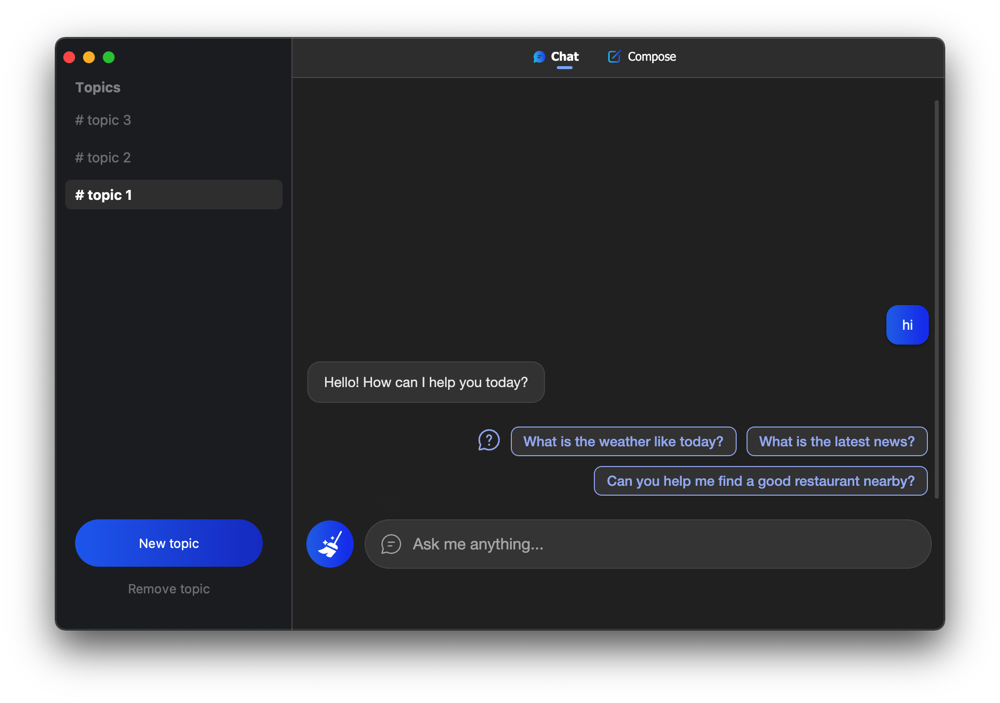

  
  <h1 align="center">NewBingClient</h1>
  
Desktop application of new Bing's AI-powered chat 

  
  
  

## Features

- [x] Chat with new Bing without installing Microsoft Edge or browser plugins
- [x] Support for multiple sessions
- [ ] Export sessions as Markdown, PDF, or PNG files.
- [ ] Customizable session titles.

## Screenshot

  

## Install

### MacOS

- [NewBingClient-0.0.1-darwin-x64.dmg](https://github.com/le0zh/NewBingClient/releases/download/0.0.1/NewBingClient-0.0.1-darwin-x64.dmg) (Intel chips)

### Windows

> comming soon

## Usage

- Get access to the early preview of new Bing - [Join the waitlist](https://www.bing.com/new)
- Sign in to your Microsoft account
- Start chatting

**Note: VPN is required when launching the app if new Bing is not available in your area. Make sure `bing.com` and its subdomains are included in proxy rules. You can exit VPN while chatting.**

## License

Apache-2.0 License
